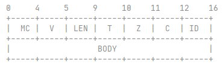

## highness-rpc

  Based on
  <a href="https://github.com/Snailclimb/guide-rpc-framework/">guide-rpc-framework</a>

### 🌠 特性概览

- [x] 可扩展SPI机制
- [x] ZK服务注册和服务发现
- [x] 基于的Netty通信模型
- [x] kryo和prostuff序列化

### 📑 自定义协议

 

| 字段 | 描述                     | 空间  |
| ---- | ------------------------ | ----- |
| MC   | magic code, 魔法数       | 4Byte |
| V    | version, 版本            | 1Byte |
| LEN  | content length, 消息长度 | 4Byte |
| T    | message type, 消息类型   | 1Byte |
| Z    | compress type, 压缩类型  | 1Byte |
| C    | codec type, 序列化类型   | 1Byte |
| ID   | sequence id, 消息ID      | 4Byte |

### 🚀 服务注册

> 服务注册用于服务器

`CustomScannerRegistrar`使用`CustomScanner`扫描`@RpcScan`指定路径下，包含`@Component`和`@RpcService`注解的bean。

- `CustomScanner`实现了Spring的`ClassPathBeanDefinitionScanner`扫描器，用于扫描包含指定注解的bean。
- `CustomScannerRegistrar`实现了Spring的`ImportBeanDefinitionRegistrar`接口，用于扫描向容器中批量注册带有bean。

`SpringBeanPostProcessor`实现的Spring的`BeanPostProcessor`的实例化后和初始化后逻辑：

- 实例化后逻辑：处理`@RpcService`注解，即服务的实现类，封装`RpcServiceConfig`对象，进行服务注册。
- 初始化后逻辑：处理`@RpcReference`注解，即服务的调用类，实现客户端的动态代理。

细节说明：

- 注册流程：
  1. `Bean`实例化后，判断`Bean`对应的`Class`是否被`@RpcService`标注，是则将该`Bean`作为`service`对象，与注解上的`group`和`version`一同封装为`RpcServiceConfig`。
  2. 调用`ServiceProvider`的`publishService`方法存储服务，首先在已注册服务`registeredServic`的集合中添加该`rpcServiceName`，并在`serviceMap`中添加`(rpcServiceName, service)`，最后调用`ServiceRegistry`的`registerService`方法将服务注册到ZooKeeper中。
  
- ZK注册：/根路径/服务名称/服务地址
  - 根路径：my-rpc
  - 服务名称：rpcServiceName = interface name + group + version
  - 服务地址：ip:port
  - 节点类型：persistent

### 🔍 服务发现

>  服务发现用于客户端

1. 客户端需要根据自己的请求`RpcRequest`进行服务发现，具体调用`ServiceDiscovery`的`lookupService`方法，该方法根据`rpcServiceName `查找`/my-rpc/rpcServiceName`下的所有子节点，将所有的子节点做一次负载均衡策略拿到具体的子节点，然后子节点的数据`ip:port`封装成`InetSocketAddress`返回。

2. 客户端再根据服务器]`InetSocketAddress`使用`ChannelProvider`获取到通信`channel`，如果`channel`为空，则让客户端连接服务器并初始化`channel`并保存，最后将`RpcRequest`封装成`RpcMessage`并使用`channel`发送。

### 📬 消息解码

Netty的长度解码器`LengthFieldBasedFrameDecoder`可以防止防止半包和粘包，使用说明：

1. 从消息开头偏移`lengthFieldOffset`长度, 到达A位置；

2. 再从A位置读取`lengthFieldLength`长度, 到达B位置, 内容是d；

3. 再从B位置读取( d+`lengthAdjustment`)长度, 达到D位置；

4. 从消息开头跳过`initialBytesToStrip`长度到达C位置；

5. 将C位置-D位置之间的内容传送给接下来的处理器进行后续处理。

消息解码器`RpcMessageDecoder`继承了`LengthFieldBasedFrameDecoder`，具体参数如下：

- `maxFrameLength`：最大帧的长度，8 * 1024 * 1024 = 8 MB。
- `lengthFieldOffset`：长度域的偏移量，需要跳过4B魔法数和1B的版本数，5B。
- `lengthFiledLength`：长度域的长度，即消息的内容长度，4B。
- `lengthAdjustment`：从长度域后开始读取内容的长度，这里不再读取，-(5+4)B。
- `initialBytesToSkip`：从长度域后跳跃的内容的长度，这里不用跳过，0B。

魔法数和版本数都是为了用于校验：

- 魔法数：4个字节，具体内容是`krpc`。
- 版本数：1个字节，具体内容在服务器中定义。

